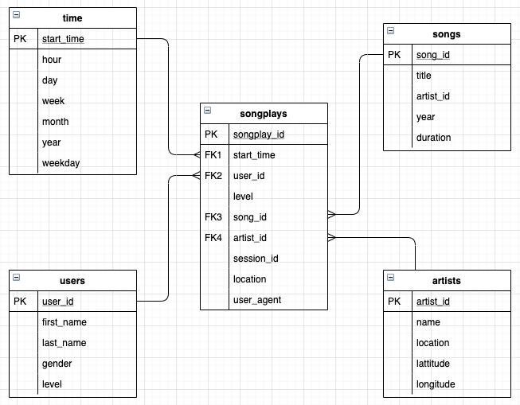

 ## Project: Sparkify Data warehouse with Redshift

This is the third project for the Data Engineering Nanodegree, in which we put in practice concepts like:
- Data warehouse
- Amazon Redshift
- ETL pipeline with Python

### Context

A startup called Sparkify wants to analyze the data they've been collecting on songs and user activity on their new music streaming app. The analytics team is particularly interested in understanding what songs users are listening to. Currently, they don't have an easy way to query their data, which resides in a directory of JSON logs on user activity on the app, as well as a directory with JSON metadata on the songs in their app.

The objective is to implement a ETL process in order to create a Amazon Redshift Data warehouse that allows the company do data analysis.

### Database Schema
In order to response to the business needs we're using a star schema, that gives to us the advantage to use simply queries and joins and do fast aggregations... way to do analytics!

The schema is compose by 4 dimentional tables and one fact table.

#### Fact Table
**songplays** - records in log data associated with song plays i.e. records with page NextSong
- songplay_id, start_time, user_id, level, song_id, artist_id, session_id, location, user_agent

#### Dimension Tables

**users** - users in the app
- user_id, first_name, last_name, gender, level

**songs** - songs in music database
- song_id, title, artist_id, year, duration

**artists** - artists in music database
- artist_id, name, location, latitude, longitude

**time** - timestamps of records in **songplays** broken down into specific units
- start_time, hour, day, week, month, year, weekday

In addition, there are two more tables **(staging)** that we used to store the data from S3 buckets.
- STAGING_EVENTS
- STAGING_SONGS

### ETL Process

For this project, most of the ETL process is done with SQL, Python is used to orchestrate the steps and execution order:

**python3 create_tables.py**
- Drop and recreate the tables schema of the data warehouse.

**python3 etl.py**
- Copy the data from S3 buckets to staging tables (STAGING_EVENTS and STAGING_SONGS)
- Load the info from staginf tables to the Data warehouse (4 dimentional tables and one fact table).